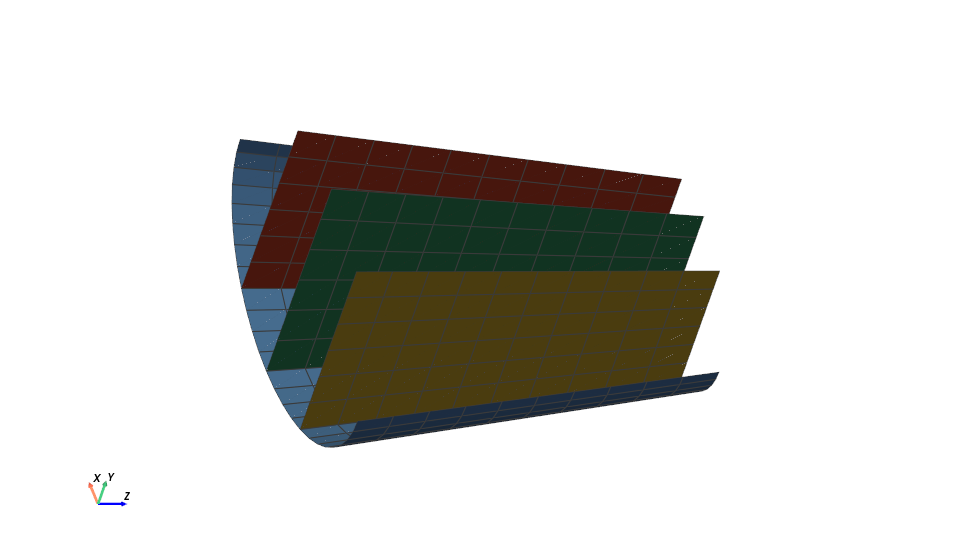
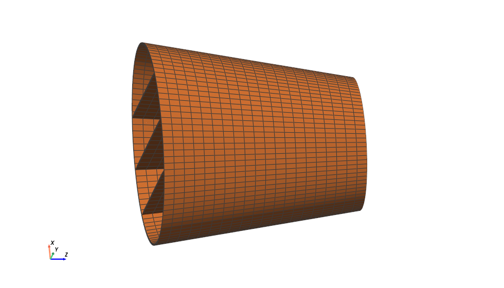
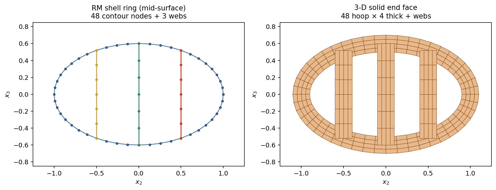

# Tapered segments: the six-parameter (independent-$\omega_3$) RM model

On a **flat-walled** tapered section the classical RM shell — with the drilling
rotation $\omega_3$ *eliminated* through the in-plane symmetry — under-predicts the
beam transverse-shear stiffness by **$-24\%$** (isotropic) to **$-40\%$** ($[-45]$)
on a thin tapered square tube, an error that is mesh-converged, grows with the taper
rate squared, and is insensitive to any regularization of the $1/C_{33}$ drilling
reciprocal. This page shows the production resolution used by OpenSG-TW's tapered
pipeline: a **single six-parameter element** — the drilling rotation kept as an
independent DOF, the in-plane symmetry enforced exactly by element-wise Lagrange
multipliers, full shear integration on the segment (the rings retain the exact
γ₂₃ tie) — used for **both** the boundary rings and the tapered segment, with the
ring warping fields (including $\omega_3$) transferred to the segment as
Dirichlet data.

All inputs, the driver scripts, and the full-$6\times6$ `.dat` are bundled under
[`mitc_rm_segment/taper_indep_study/`](https://github.com/bagla0/OpenSG-TW/tree/main/mitc_rm_segment/taper_indep_study).

## Why the eliminated drilling fails on flat walls

The elimination $\omega_3=\big(S/2-y_\beta\omega_\beta\big)/C_{33}$ divides by
$C_{33}=\mathbf{a}_3\cdot\mathbf{b}_3$, which vanishes **identically over every flat
wall whose normal is perpendicular to $\mathbf{b}_3$** — exactly the walls that
carry the $V_3$ shear flow. On a smooth (circular) section $C_{33}=0$ only at
isolated points and nothing goes wrong; on the square the degeneracy covers whole
walls and the tapered transverse shear collapses. Keeping $\omega_3$ independent
removes every reciprocal from the strain operators (they become polynomial in the
direction cosines) and restores the symmetry condition as a finite constraint row
$g = y_k\omega_k - S/2 = 0$, enforced by one Lagrange multiplier per element.

## Results — all 8 cases at strong taper ($a_R=0.7$)

Tapered-segment diagonal errors vs the FEniCS 3-D solid (48×10 shell mesh;
$C_{22}=C_{33}$ is satisfied **identically** — the drilling boundary data enforce
the square's physical shear symmetry by construction):

| case | EA | GA₂ | GA₃ | GJ | EI₂ | EI₃ |
|---|---|---|---|---|---|---|
| square thin iso | +1.0% | −2.9% | −2.9% | −2.4% | +1.0% | +1.0% |
| square thin [-45] | +1.3% | **−1.7%** | **−1.7%** | −4.4% | +2.3% | +2.3% |
| square thick iso | +0.7% | −4.5% | −4.5% | −4.5% | −0.3% | −0.3% |
| square thick [-45] | +0.8% | +1.9% | +1.9% | −6.1% | +1.7% | +1.7% |
| circle thin iso | +1.2% | +3.8% | +3.8% | +1.2% | +1.3% | +1.3% |
| circle thin [-45] | +0.8% | +5.1% | +5.1% | +0.0% | +2.0% | +2.0% |
| circle thick iso | +1.0% | +2.2% | +2.2% | +0.7% | +0.2% | +0.2% |
| circle thick [-45] | +0.3% | +3.5% | +3.5% | −1.1% | +0.9% | +0.9% |

The eliminated-drilling operator on the same thin square gives GA₃ = −24.4%/−39.9%
with the coupling C₃₆ at −39.7% — the motivation for the six-parameter model.

## Cross-sections: 5-DOF MITC vs 6-DOF ring (square)

The same element solves the boundary rings on a wrapped strip. On the flat-walled
cross-section it matches the validated 5-DOF eliminated+MITC element on EA/GA/EI and
**repairs the ring torsion** (the floored drilling reciprocal injects a small
spurious prismatic GJ on flat walls):

| stiffness | 5-DOF MITC (iso) | 6-DOF (iso) | 5-DOF MITC ([-45]) | 6-DOF ([-45]) |
|---|---|---|---|---|
| EA | +0.0% | +0.0% | +0.8% | +0.8% |
| GA₂ | −3.6% | −3.3% | +1.1% | +1.5% |
| GA₃ | −3.7% | −3.3% | +0.9% | +1.5% |
| **GJ** | **+9.6%** | **−3.8%** | **+9.0%** | **+1.4%** |
| EI₂=EI₃ | −0.0% | −0.0% | +0.5% | +0.6% |

Both rings use their production shear treatments; on the span-invariant strip the
assumed γ₂₃ field reproduces the true shear exactly, so the treatment is exact
there by construction.

## Transverse shear: no MITC required (and canonical MITC is harmful)

The production scheme is **full 2×2 integration of both shear rows on the tapered
segment**, with the Dvorkin–Bathe **γ₂₃ tie retained only on the boundary rings**
(where it is exact by construction on the span-invariant strip — and verified
*inert*, see below). No assumed-strain protection is needed anywhere, for two
structural reasons:

1. **The discrete shear constraint restricts only the rotations.** The rows carry
   the rotations algebraically through the full-rank tangential traces
   ($2\gamma_{13}\supset x_{i;2}\,\omega_i$, $2\gamma_{23}\supset-x_{i;1}\,\omega_i$),
   so for any displacement field the thin-limit condition is solvable pointwise
   for the rotations — the constraint never eliminates a displacement mode.
2. **The SG fluctuation problem is never bending-dominated.** The Kirchhoff-mode
   content is carried analytically by the section-strain columns and by the ring
   Dirichlet data; the shear/twist load columns demand genuinely *finite* shear.

Certification (worst cases, all on the server):

- **Prismatic flat-wall identity** (`run_locksq.py`): the square segment
  reproduces its own ring to **±0.00% on every constant at t/R = 2·10⁻², 2·10⁻³,
  2·10⁻⁴**, both meshes, every shear scheme.
- **Boundary rings, square vs ellipse** (`run_ringboun.py`): full integration vs
  γ₂₃-tied agree within **0.05 points** on every constant, every mesh (48→384
  hoop), and every thickness over two decades — errors decay ∝ nc⁻² and are
  thickness-invariant, i.e. pure discretization, no locking signature on flat
  *or* curved boundaries. The MITC requirement reported for the 5-DOF
  eliminated-drilling cross-sectional element does **not** carry over to the
  6-DOF constrained element.
- **Prismatic circle probe**: errors vs closed form identical at t/R = 0.02 and
  0.002; a 5-DOF full-integration control is equally clean.

Conversely, **canonical MITC tying (whole rows, rotation columns included) must
not be used** with the 6-DOF element: it aliases the algebraic drilling content
(x₃;₂ω₃ — the role ω₂ plays prismatically) and collapses the flat-wall shears
(thin square −29/−47%; webbed ellipse −17/+29%, next section). A flux-only tie
(rotation columns kept at Gauss values) reproduces full integration to machine
precision — there is no flux-side locking to remove.

## Blade-like example: tapered ellipse with three webs

The discriminating validation case: a differentially tapered elliptical skin
(a: 1.0→0.65, b: 0.60→0.42 over L = 2.0, hoop curvature varying around *and*
along), three flat webs tapering with the section at x = ±a/2 and x = 0 (six
T-junction lines), t = 0.02, single [-45] ply — a four-cell blade-like layout,
compared against a fresh conforming 3-D solid (96×20×4, web end columns sharing
the skin through-thickness columns):




Segment diagonal %err vs solid (shell 48×10 skin + 6 elements/web, `run_ell3w.py`):

| scheme | EA | GA₂ | GA₃ | GJ | EI₂ | EI₃ |
|---|---|---|---|---|---|---|
| **full integration (production)** | +3.8 | +8.0 | +10.1 | **+0.0** | +6.7 | +2.3 |
| canonical MITC (both rows) | +4.4 | **−16.7** | **+28.9** | −0.1 | +2.6 | +3.3 |

Full integration stays coherent (GJ exact, shears +8/+10% — a scheme-independent
junction/model residual); canonical tying scatters the shears wildly. On webbed
sections the shear treatment is not cosmetic.

## Boundary cross-section: multi-cell homogenization and cost

The boundary stage is itself a cross-sectional homogenization — each end ring is a
span-invariant SG giving the section's **beam** Timoshenko stiffness $C^b_{ij}$
(superscript `b` = beam). The RM shell solves it as a 1-D mid-surface ring; the
solid as a 2-D through-thickness-resolved end face (`render_ell_boundary.py`):



For the **thick** ($t=0.2$) webbed ellipse this is a genuine multi-cell
homogenization; every nonzero $C^b_{ij}$ vs the 3-D solid boundary
(`time_boundary_3cases.py`):

| $C^b_{ij}$ | solid ×10⁹ | shell ×10⁹ | %err |
|---|---|---|---|
| $C^b_{11}$ EA | 19.871 | 20.476 | +3.0 |
| $C^b_{22}$ GA₂ | 5.234 | 5.294 | +1.1 |
| $C^b_{33}$ GA₃ | 6.688 | 6.897 | +3.1 |
| $C^b_{44}$ GJ | 4.512 | 4.563 | +1.1 |
| $C^b_{55}$ EI₂ | 3.278 | 3.358 | +2.4 |
| $C^b_{66}$ EI₃ | 6.642 | 6.729 | +1.3 |
| $C^b_{13}$ | 1.823 | 2.029 | +11.3 |
| $C^b_{14}$ | −2.403 | −2.513 | +4.6 |
| $C^b_{25}$ | 1.378 | 1.429 | +3.7 |
| $C^b_{36}$ | 1.128 | 1.219 | +8.1 |
| $C^b_{46}$ | −0.162 | −0.176 | +8.4 |

(Couplings below 0.5% of EA — $C^b_{16},C^b_{23},C^b_{34}$ — are near-zero, omitted.)
Diagonals within 3.1%, ply couplings within 3.7–11.3%.

The boundary (two end cross-sections) is also cheap vs the solid — RM ring (6 DOF/
contour node) vs solid boundary (3 DOF/node of the hoop × 4-thick end face), warm,
mesh I/O excluded:

| section (thick m45) | shell #DOF | shell s | solid #DOF | solid s | speed-up |
|---|---|---|---|---|---|
| square | 288 | 0.07 | 720 | 0.22 | 3.4× |
| circle | 288 | 0.07 | 720 | 0.26 | 3.4× |
| webbed ellipse | 378 | 0.09 | 1935 | 0.29 | 3.4× |

The shell boundary is 2.5–5× smaller and ~3.4× faster, the ratio holding as the
webs enlarge the solid face.

## Large-scale example: million-DOF solid vs refined shell

For a smooth tapered ellipse (a:1.0→0.65, b:0.60→0.42, [-45] ply, t/R=0.02, **no
webs** so the shell refines cleanly — a *webbed* section's shears drift under
refinement, see convergence below) the two solvers run at production scale
(`run_large_smooth.py`). At >10⁵ DOF the shell assembles and solves in **sparse**
form (`shell_solve_lagrange_sparse`; the dense 1.2×10⁵-square matrices would be
115 GB), with the V0/V1 Dirichlet solves sharing one factorization:

| | 3-D solid | RM shell |
|---|---|---|
| #DOF | 1,198,080 | 119,808 |
| mesh nodes | 399,360 | 19,968 |
| homogenization (warm) | 99.9 s | 18.8 s |
| EA | 0.9842 | 0.9937 (+1.0%) |
| GA₂ | 0.3297 | 0.3512 (+6.5%) |
| GA₃ | 0.1651 | 0.1721 (+4.3%) |
| GJ | 0.2182 | 0.2188 (+0.3%) |
| EI₂ | 0.1472 | 0.1489 (+1.1%) |
| EI₃ | 0.3041 | 0.3098 (+1.9%) |

The refined shell reaches every diagonal of the **million-DOF** solid within
0.3–6.5% (extension/torsion/bending <2%, shears 4–7% = thin-shell model error, not
discretization) with **10× fewer DOF** and no through-thickness meshing — the
advantage that multiplies across a full blade's tapered stations. (The sparse
driver is bit-identical to the dense one on smooth sections, ≤1e-13; scripts:
`verify_sparse_driver.py`, `run_large_smooth.py`.)

## Mesh convergence

Proportional refinement 24×5 → 96×20, thin wall, strong taper, fixed solid
reference:


- **Circle**: converged — every curve moves < 0.4 points over 16× more elements;
  the +4–5% shear plateau is the shell-model error at this slenderness.
- **Square**: accurate at engineering resolution (+0.02% at 24×5, −2.9% at 48×10,
  isotropic) with a slow fold-line drift under further refinement (−8.6% iso /
  −17.4% [-45] at 96×20): the smooth-patch symmetry constraint over-constrains the
  C⁰-shared rotations across the four fold lines. The ω₃ boundary data halve the
  drift relative to free end drilling; a fold-consistent drilling treatment is the
  open question. GJ/EA/EI are mesh-insensitive throughout. Practical guidance:
  near-unit element aspect ratio, ~12 elements per wall.

## Computational cost

Problem size and wall-clock seconds, single core (32-core Linux server). The
operator evaluation is **vectorized over elements** (batched numpy `einsum`
assembly; the former per-element/per-Gauss-point Python loop dominated the wall
time), the orientation PNGs are drawn only when missing, and every direct
factorization (segment Dirichlet, ring KKT) is built once and reused for the V0
*and* V1 solves — certified identical to the scalar loop to ≤3·10⁻¹⁵ per matrix
by `verify_shell_batch.py`. The solid column is the equally optimized FEniCS
solver (cached MUMPS factorizations, shared JIT kernels). Times are the OpenSG
**homogenization compute only** — rings+segment (shell), boundary+taper (solid) —
timed **warm** (first-run JIT dropped) and **excluding runtime mesh
construction/extraction** (`retime_all.py`). Shell DOF = 6×nodes, solid DOF =
3×nodes:

| case | shell #DOF | shell time | solid #DOF | solid time |
|---|---|---|---|---|
| square thick m45 | 3168 | **0.83** | 7920 | 1.60 |
| circle thick m45 | 3168 | **0.83** | 7920 | 1.52 |
| webbed ellipse m45 | 4158 | **1.17** | 40635 | 4.67 |

The decisive quantity is the DOF count: the shell carries 6 warping DOFs per
mid-surface node, the solid 3 per through-thickness-resolved node. On the
square/circle both homogenize near a second (3168 vs 7920 DOF); on the webbed
ellipse the shell resolves the four-cell section with **4158 DOF vs the solid's
40635**, and the compute separates (1.2 s vs 4.7 s). The shell cost is
additionally independent of the layup count — the wall enters only through the
precomputed 8×8 laminate stiffness 𝒦, with no through-thickness meshing of
tapered, layup-dropping walls.

## Reproduce

```bash
# on the compute server (conda env opensg_2_0)
cd mitc_rm_segment
python run_taper_indep_study.py      # 8 cases -> taper_indep_results.dat (+ timing)
python run_paper_convergence.py      # 5-level mesh sweep -> paper_convergence.{dat,npz}
python run_extras.py                 # shear ablation + locking probe
python plot_paper_convergence.py     # -> fig_convergence.png + timing_summary.dat
python run_ring_indep.py             # 5-DOF vs 6-DOF ring comparison
python run_locksq.py                 # prismatic flat-wall identity, t/R -> 2e-4
python run_ringboun.py               # ring locking experiment: square vs ellipse
python run_ell3w.py                  # webbed-ellipse benchmark (+ fresh solid ref)
python render_ell3w.py               # cutaway mesh figures
```

Solver entry points: `run_indep.shell_solve_lagrange` (segment, all-6-DOF) and
`run_ring_indep.ring_indep` (ring); operators in `segment_indep.py`. Solid
references: `examples/data/benchmark/taper_{square,study}_solid_{iso,m45}.npz`.
