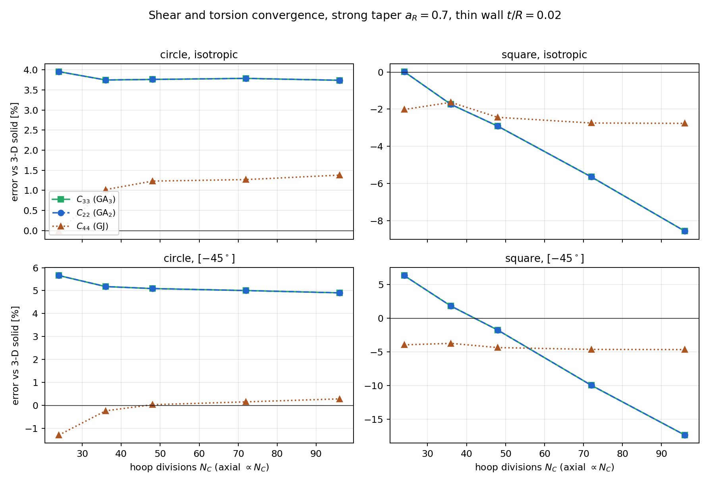

# Tapered segments: the six-parameter (independent-$\omega_3$) RM model

On a **flat-walled** tapered section the classical RM shell — with the drilling
rotation $\omega_3$ *eliminated* through the in-plane symmetry — under-predicts the
beam transverse-shear stiffness by **$-24\%$** (isotropic) to **$-40\%$** ($[-45]$)
on a thin tapered square tube, an error that is mesh-converged, grows with the taper
rate squared, and is insensitive to any regularization of the $1/C_{33}$ drilling
reciprocal. This page shows the production resolution used by OpenSG-TW's tapered
pipeline: a **single six-parameter element** — the drilling rotation kept as an
independent DOF, the in-plane symmetry enforced exactly by element-wise Lagrange
multipliers, full shear integration — used for **both** the boundary rings and the
tapered segment, with the ring warping fields (including $\omega_3$) transferred to
the segment as Dirichlet data.

All inputs, the driver scripts, and the full-$6\times6$ `.dat` are bundled under
[`mitc_rm_segment/taper_indep_study/`](https://github.com/bagla0/OpenSG-TW/tree/main/mitc_rm_segment/taper_indep_study).

## Why the eliminated drilling fails on flat walls

The elimination $\omega_3=\big(S/2-y_\beta\omega_\beta\big)/C_{33}$ divides by
$C_{33}=\mathbf{a}_3\cdot\mathbf{b}_3$, which vanishes **identically over every flat
wall whose normal is perpendicular to $\mathbf{b}_3$** — exactly the walls that
carry the $V_3$ shear flow. On a smooth (circular) section $C_{33}=0$ only at
isolated points and nothing goes wrong; on the square the degeneracy covers whole
walls and the tapered transverse shear collapses. Keeping $\omega_3$ independent
removes every reciprocal from the strain operators (they become polynomial in the
direction cosines) and restores the symmetry condition as a finite constraint row
$g = y_k\omega_k - S/2 = 0$, enforced by one Lagrange multiplier per element.

## Results — all 8 cases at strong taper ($a_R=0.7$)

Tapered-segment diagonal errors vs the FEniCS 3-D solid (48×10 shell mesh;
$C_{22}=C_{33}$ is satisfied **identically** — the drilling boundary data enforce
the square's physical shear symmetry by construction):

| case | EA | GA₂ | GA₃ | GJ | EI₂ | EI₃ |
|---|---|---|---|---|---|---|
| square thin iso | +1.0% | −2.9% | −2.9% | −2.5% | +1.0% | +1.0% |
| square thin [-45] | +1.3% | **−1.7%** | **−1.7%** | −4.4% | +2.3% | +2.3% |
| square thick iso | +0.7% | −4.5% | −4.5% | −4.5% | −0.3% | −0.3% |
| square thick [-45] | +0.8% | +1.9% | +1.9% | −6.1% | +1.7% | +1.7% |
| circle thin iso | +1.2% | +3.8% | +3.8% | +1.2% | +1.3% | +1.3% |
| circle thin [-45] | +0.8% | +5.1% | +5.1% | +0.0% | +2.0% | +2.0% |
| circle thick iso | +1.0% | +2.2% | +2.2% | +0.7% | +0.2% | +0.2% |
| circle thick [-45] | +0.3% | +3.5% | +3.5% | −1.1% | +0.9% | +0.9% |

The eliminated-drilling operator on the same thin square gives GA₃ = −24.4%/−39.9%
with the coupling C₃₆ at −39.7% — the motivation for the six-parameter model.

## Cross-sections: 5-DOF MITC vs 6-DOF ring (square)

The same element solves the boundary rings on a wrapped strip. On the flat-walled
cross-section it matches the validated 5-DOF eliminated+MITC element on EA/GA/EI and
**repairs the ring torsion** (the floored drilling reciprocal injects a small
spurious prismatic GJ on flat walls):

| stiffness | 5-DOF MITC (iso) | 6-DOF (iso) | 5-DOF MITC ([-45]) | 6-DOF ([-45]) |
|---|---|---|---|---|
| EA | +0.0% | +0.0% | +0.8% | +0.8% |
| GA₂ | −3.6% | −3.3% | +1.1% | +1.5% |
| GA₃ | −3.7% | −3.3% | +0.9% | +1.5% |
| **GJ** | **+9.6%** | **−3.8%** | **+9.0%** | **+1.4%** |
| EI₂=EI₃ | −0.0% | −0.0% | +0.5% | +0.6% |

Both rings use their production shear treatments; on the span-invariant strip the
assumed γ₂₃ field reproduces the true shear exactly, so the treatment is exact
there by construction.

## Transverse-shear treatment

The production scheme ties the rows that carry the displacement flux
$y_i\,w_{i|\alpha}$, always keeping the **rotation columns at their
full-integration values** (the shear rows carry the rotations algebraically —
$2\gamma_{13}\supset x_{k;2}\,\omega_k$ — and interpolating that director content
would de-penalize it):

- **boundary rings**: tie **γ₂₃ only** — under span invariance γ₁₃ has no
  $w_i$ derivatives (it is algebraic in the directors);
- **tapered segment**: tie **both rows** (both carry the flux) at the standard
  Dvorkin–Bathe points.

The scheme is locking-free: on a prismatic isotropic circle at the coarsest mesh
(24×5) the errors vs the closed-form constants are **identical at t/R = 0.02 and
t/R = 0.002** (GA within 0.2%, GJ within 1.9%) — thickness-independence of the
discretization error being the definitive absence-of-locking signature. A 5-DOF
control is equally clean, showing the immunity is a property of the
section-strain load structure of the homogenization problem itself.

## Mesh convergence

Proportional refinement 24×5 → 96×20, thin wall, strong taper, fixed solid
reference:



- **Circle**: converged — every curve moves < 0.4 points over 16× more elements;
  the +4–5% shear plateau is the shell-model error at this slenderness.
- **Square**: accurate at engineering resolution (+0.02% at 24×5, −2.9% at 48×10,
  isotropic) with a slow fold-line drift under further refinement (−8.6% iso /
  −17.4% [-45] at 96×20): the smooth-patch symmetry constraint over-constrains the
  C⁰-shared rotations across the four fold lines. The ω₃ boundary data halve the
  drift relative to free end drilling; a fold-consistent drilling treatment is the
  open question. GJ/EA/EI are mesh-insensitive throughout. Practical guidance:
  near-unit element aspect ratio, ~12 elements per wall.

## Computational cost

Wall-clock seconds per case, single core (32-core Linux server), reference mesh:

| case | extract | rings | segment | shell total | solid (boun+taper) |
|---|---|---|---|---|---|
| square thin iso | 1.0 | 2.0 | 11.6 | **14.7** | 6 |
| square thick iso | 0.9 | 1.5 | 11.2 | **13.6** | 44 |
| circle thin iso | 1.0 | 1.5 | 11.2 | **13.6** | 17 |
| circle thick m45 | 0.8 | 1.5 | 11.1 | **13.4** | 16 |

The shell cost is independent of geometry, thickness, and — unlike the solid, which
must resolve every ply through the thickness — of the layup count.

## Reproduce

```bash
# on the compute server (conda env opensg_2_0)
cd mitc_rm_segment
python run_taper_indep_study.py      # 8 cases -> taper_indep_results.dat (+ timing)
python run_paper_convergence.py      # 5-level mesh sweep -> paper_convergence.{dat,npz}
python run_extras.py                 # shear ablation + locking probe
python plot_paper_convergence.py     # -> fig_convergence.png + timing_summary.dat
python run_ring_indep.py             # 5-DOF vs 6-DOF ring comparison
```

Solver entry points: `run_indep.shell_solve_lagrange` (segment, all-6-DOF) and
`run_ring_indep.ring_indep` (ring); operators in `segment_indep.py`. Solid
references: `examples/data/benchmark/taper_{square,study}_solid_{iso,m45}.npz`.
